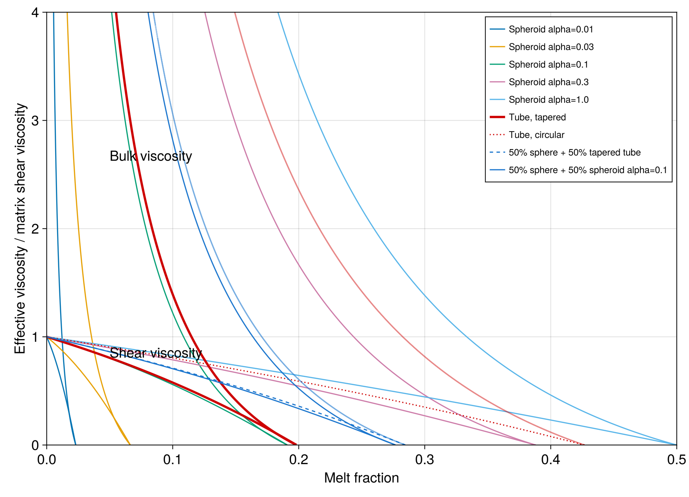

# ModVisc.jl

`ModVisc.jl` implements the self-consistent poroelastic and viscous inclusion
models described by Schmeling, Kruse & Richard (2012). It implements the
relaxed viscous model and the unrelaxed/relaxed elastic model for films, tubes,
spheroids, and fixed mixtures of those geometries.

```julia
using ModVisc

model = ViscousModel(
    1.0,
    MeltFraction(Tube(0.0), 0.5),
    MeltFraction(Spheroid(1.0), 0.5),
)

result = viscosity(model, 0.05)
profile = viscosity_profile(model, 10.0 .^ range(-6, log10(0.5); length=1000))
# Equivalent collection dispatch:
profile = viscosity(model, 10.0 .^ range(-6, log10(0.5); length=1000))

elastic_model = ElasticModel(
    66e9,
    40e9,
    20e9,
    PoreFraction(Spheroid(0.1), 0.0, 1.0);
    matrix_density=3300.0,
    density_contrast=300.0,
)
properties = elasticity(elastic_model, 0.01)
```

The scalar `viscosity` and `elasticity` paths are type stable and allocation
free after compilation for concrete model and numeric types. They return
convergence metadata rather than silently treating the last iterate as
converged.

See [`docs/src/model.md`](docs/src/model.md) for the equation mapping and
[`examples/paper_figures.jl`](examples/paper_figures.jl) for the paper figure
reproduction workflow.

## Paper figure reproduction

[](https://albert-de-montserrat.github.io/ModVisc.jl/dev/paper_figures/)

Reproduction of the model curves in Figure 2 of Schmeling, Kruse & Richard
(2012). See the [paper figures documentation](https://albert-de-montserrat.github.io/ModVisc.jl/dev/paper_figures/)
for the Julia code, Figure 3, and the limits of the reproduction.

## Reference

Schmeling, H., Kruse, J. P. & Richard, G. (2012). Effective shear and bulk
viscosity of partially molten rock based on elastic moduli theory of a fluid
filled poroelastic medium. *Geophysical Journal International*, 190,
1571–1578. <https://doi.org/10.1111/j.1365-246X.2012.05596.x>

## License

ModVisc.jl is distributed under the MIT License. Portions derived from the
original MATLAB implementation remain subject to its BSD 2-Clause notice in
[THIRD_PARTY_LICENSES.md](THIRD_PARTY_LICENSES.md).
