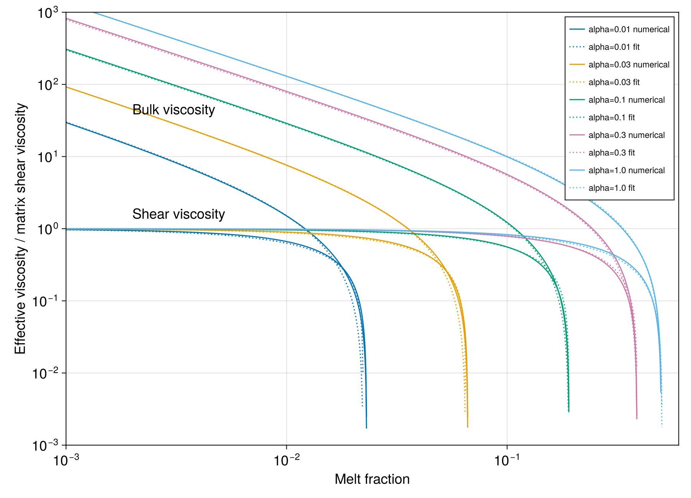

# Paper figures

The examples below recreate the model curves in Figures 2 and 3 of Schmeling,
Kruse & Richard (2012). Viscosities are normalized by the matrix shear
viscosity, so each model uses `matrix_shear = 1`.

The complete plotting program is
[`examples/paper_figures.jl`](https://github.com/albert-de-montserrat/ModVisc.jl/blob/main/examples/paper_figures.jl).
Run it from the repository root with:

```shell
julia --project=examples -e 'using Pkg; Pkg.instantiate()'
julia --project=examples examples/paper_figures.jl
```

It writes PNG versions of both figures to `examples/output/`. Curves below
`1e-3` are omitted, following the cutoff used by the original plotting code.

## Figure 2: pore geometry and disaggregation

Figure 2 compares effective bulk and shear viscosity for spheroids, tapered
and circular tubes, and two mixed pore geometries. A pure-geometry model is
constructed with one `MeltFraction` whose fraction is one:

```julia
using ModVisc

pure(geometry) = ViscousModel(1.0, MeltFraction(geometry, 1.0))
porosity = collect(range(1e-6, 0.52; length=1200))

spheroids = [
    viscosity_profile(pure(Spheroid(α)), porosity)
    for α in (0.01, 0.03, 0.1, 0.3, 1.0)
]

tapered_tube = viscosity_profile(pure(Tube(0.0)), porosity)
circular_tube = viscosity_profile(pure(Tube(Inf)), porosity)
```

Mixtures use multiple `MeltFraction` components. Their fractions describe the
share of total pore volume assigned to each geometry and must sum to one:

```julia
sphere_tube = ViscousModel(
    1.0,
    MeltFraction(Spheroid(1.0), 0.5),
    MeltFraction(Tube(0.0), 0.5),
)

sphere_spheroid = ViscousModel(
    1.0,
    MeltFraction(Spheroid(1.0), 0.5),
    MeltFraction(Spheroid(0.1), 0.5),
)

mixed_tube = viscosity_profile(sphere_tube, porosity)
mixed_spheroid = viscosity_profile(sphere_spheroid, porosity)
```


The upper family of curves is the bulk viscosity and the lower family is the
shear viscosity. Each curve terminates when the connected solid framework
disaggregates. The experimental and external-model overlays in the published
figure are absent because their numerical data are not included with the
original ModVisc source.

[Open Figure 2 at full resolution](assets/figure2.png)

## Figure 3: numerical solution and equation 5 fit

Figure 3 compares the self-consistent spheroid solution with the analytical
fit given by equation 5. Solid lines show `viscosity_profile`; dotted lines
show `spheroid_fit`:

```julia
using ModVisc

pure(geometry) = ViscousModel(1.0, MeltFraction(geometry, 1.0))
porosity = 10.0 .^ range(-3, log10(0.6); length=1200)

for α in (0.01, 0.03, 0.1, 0.3, 1.0)
    numerical = viscosity_profile(pure(Spheroid(α)), porosity)
    fitted = spheroid_fit.(porosity, α)

    numerical_bulk = numerical.bulk
    numerical_shear = numerical.shear
    fitted_bulk = getproperty.(fitted, :bulk)
    fitted_shear = getproperty.(fitted, :shear)
end
```



The agreement is closest at low porosity. The curves separate near their
geometry-dependent disaggregation porosity, where both effective viscosities
fall rapidly.

[Open Figure 3 at full resolution](assets/figure3.png)
